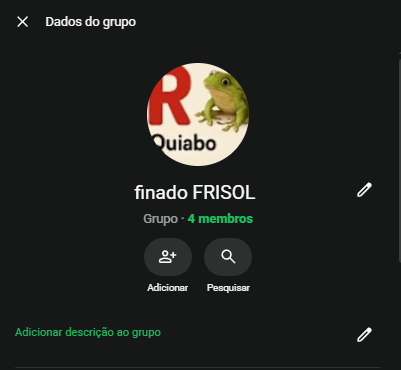
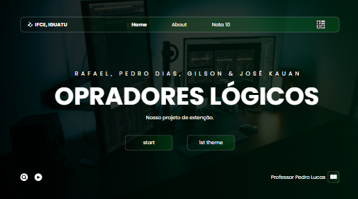
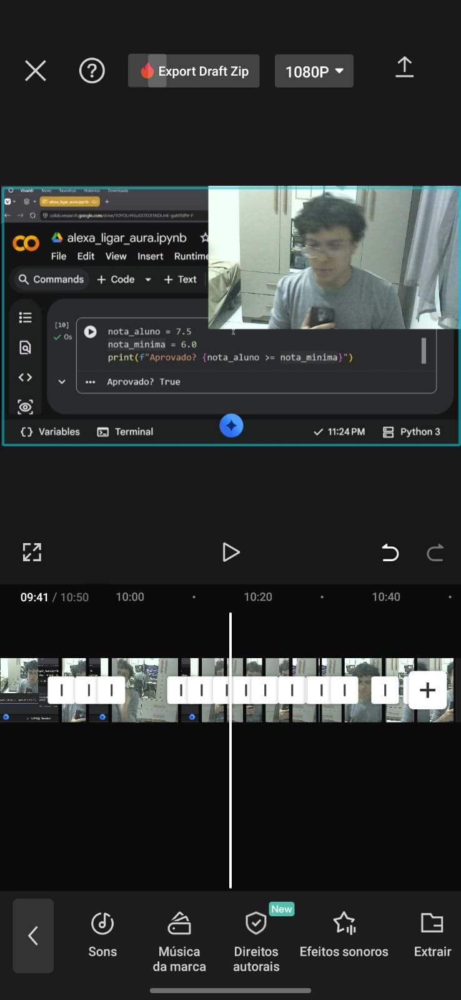
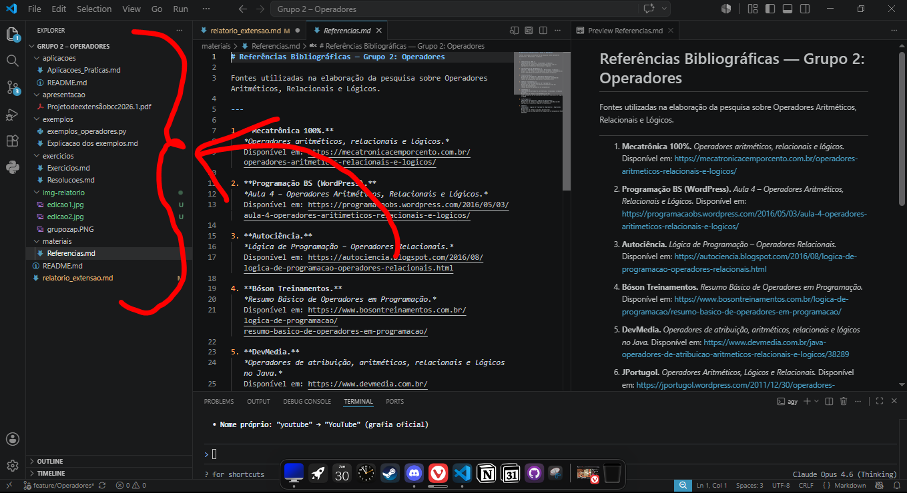
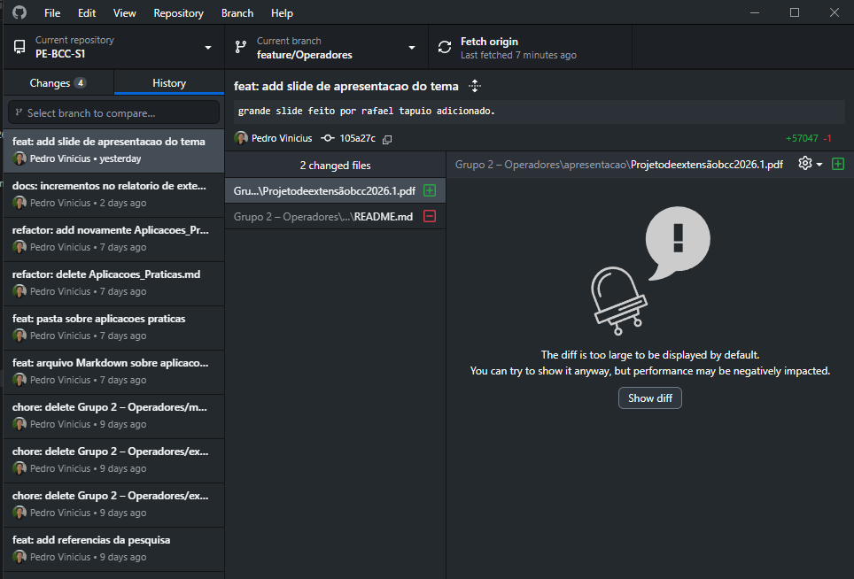

# Relatório Final de Extensão

### Dados do Grupo

| Item                | Informação             |
| ------------------- | ---------------------- |
| Tema                | Operadores             |
| Integrantes         | Pedro Vinicius, José Kauan, Rafael Lopes, Gilson Galdino|
| Professor           | Prof. Pedro Lucas Luz  |
| Período de execução | 10/06/26 - 30/06/26                      |

---

# 1. Introdução

A lógica de programação é o conjunto de regras e técnicas usado para criar o algoritmo que instrui um computador a resolver problemas. Ela independe de linguagem e foca no desenvolvimento do raciocínio estruturado, organização e clareza para atingir objetivos específicos.  
Dentro do âmbito da lógica geral, existe o conceito de Operadores, que são símbolos ou palavras-chave utilizados para manipular variáveis, comparar valores, realizar cálculos e tomar decisões, e esse conceito também é presente em lógica de programação.  
Neste projeto de extensão, nossa equipe realizou um estudo sobre o tema "Operadores", no contexto da lógica de programação, apresentando materiais didáticos e exemplos práticos voltados a iniciantes.  
O trabalho foi desenvolvido através de pesquisas, elaboração de exercícios, implementação de exemplos em código Python e apresentação em uma vídeo-aula aberta ao público no YouTube.

# 2. Atividades Desenvolvidas

### 2.1 Planejamento

Em um primeiro momento, após uma reunião realizada entre o professor orientador (Prof. Pedro Lucas Luz) e os líderes de cada equipe, foram repassadas as informações e orientações do projeto de extensão.
Após isso, o grupo se reuniu e decidiu criar um grupo no WhatsApp para debater sobre o projeto e suas atribuições.  

 <small>Inclusive, grupo extremamente profissional kkkk</small>

  
 
 
Através do grupo, definimos as responsabilidades de cada membro da seguinte forma:

| Membro              | Função                 | Ações          
| ------------------- | ---------------------- | --------------                
| Pedro Vinicius      | Líder                  | Gerenciar repositório da equipe no GitHub, Escrever o relatório de extensão final.
| José Kauan          | Pesquisador            | Realizar a pesquisa de conteúdos do tema, Elaborar exemplos e exercícios.
| Rafael Lopes        | Criador do Slide       | Elaborar apresentação em forma de slide, contendo todos os conteúdos abordados na pesquisa e exemplos.
| Gilson Galdino      | Editor do Vídeo        | Escrever o roteiro completo da vídeo-aula, Editar o vídeo para postar no YouTube.  

Portanto, grupo optou por utilizar como ferramentas: GitHub para controle de versão, WhatsApp para planejamentos e discussões, Canva para produção do slide, além do CapCut e Alight Motion para edição do vídeo.

---

#### 2.2 Pesquisa e Estudo

A pesquisa sobre conteúdo, realizada por José Kauan, foi feita consultando videoaulas e materiais didáticos sobre lógica de programação, sobretudo de operadores (aritméticos, atribuição, relacionais, lógicos, etc.).  
Algumas fontes utilizadas foram a DIO, Autociência, ProgramaçãoBS, entre outros.  
Os demais integrantes do grupo leram os conteúdos da pesquisa para se aprofundar, e servir de base para a criação dos slides e roteiro da videoaula.

---

#### 2.3 Produção dos Materiais

O slide foi criado a partir do roteiro do video, pelo Rafael Lopes, utilizando uma linguagem mais assertiva e direta, de fácil entendimento. Todo o processo de criação foi feito usando o Canva para estudantes.  
Os exercícios e demonstrações em código, propostos por José Kauan, foram feitos baseados em exemplos da internet, e adaptados para um melhor entendimento didático.  
Todo o processo de criação dos materiais foi revisado e aprovado pelos membros da equipe para uma melhor harmonia em relação ao vídeo, roteiro e slide.

 

---

#### 2.4 Preparação da Apresentação

Após um debate entre os membros da equipe, foi definido que nosso meio de compartilhar os conhecimentos estudados com o público externo seria através de uma videoaula, com a participação de todos os integrantes, que seria publicada no YouTube. Gilson Galdino ficou responsável pela produção do vídeo (edição e roteiro).  
Para a escrita do roteiro, foi usado como inspiração a dinâmica dos vídeos do criador de conteúdo Mateus 505, e foi feita uma base de apresentação separada em 4 tópicos para cada apresentador, usando as pesquisas sobre o tema como fonte.

---

#### 2.5 Gravação e Edição da Videoaula

Quando o roteiro foi finalizado, cada membro foi responsável por gravar sua participação individualmente, seguindo as falas e indicações feitas pelo editor.  
Depois das gravações, os arquivos brutos foram enviados para a edição, onde foram feitos cortes de erros e momentos de silêncio, músicas de fundo foram adicionadas, textos, memes e trechos do slide feito pela equipe, tudo em busca de tornar o vídeo mais dinâmico e agradável possível.

 <small>Errou, errou meu chat gpt</small>

---

# 3. Resultados Obtidos

O projeto nos possibilitou ampliar os conhecimentos sobre Operadores, anteriormente adquiridos na disciplina de Lógica de Programação, e melhorar nossas habilidades de comunicação, organização de projeto e trabalho em equipe.  
A principal dificuldade enfrentada foi a produção de um material original, que fosse didático e coerente com o conteúdo apresentado, mas que também tivesse nossa identidade e fosse suficiente para atender o público externo, desafio esse que foi superado por meio da divisão de tarefas entre a equipe, extraindo o melhor das capacidades de cada membro.

---

# 4. Utilização do GitHub

O GitHub foi a principal ferramenta utilizada para armazenar os materiais de pesquisa produzidos pelo grupo e garantir o bom versionamento do projeto.  
O membro Pedro Vinicius ficou responsável por organizar o repositório contendo os arquivos produzidos e realizar os commits seguindo os padrões indicados na instrução da atividade.  
O repositório foi organizado através de pastas destinadas a cada parte do trabalho, onde os arquivos foram adicionados de forma harmônica e coerente com sua função no projeto.  

 <small>organização das pastas do repositório (ainda não finalizado)</small>
 
Os commits foram sendo realizados conforme as produções iam ocorrendo, garantindo mais segurança ao trabalhar em passos futuros, e sendo possível visualizar as alterações feitas nos arquivos.

 <small>histórico de commits</small>

---

# 5. Considerações Finais

As tarefas propostas foram realizadas com sucesso. Essa experiência contribuiu para o aprofundamento de conhecimentos relacionados à lógica de programação e o desenvolvimento de habilidades relacionadas à colaboração, comunicação e resolução de conflitos.  
Ademais, foi constatada a importância de compartilhar conhecimentos e aprendizados relacionados à tecnologia com a comunidade, de forma a democratizar o acesso aos mesmos.

---

# 6. Evidências e Anexos

| Evidência        | Link |
| ---------------- | ---- |
| GitHub           | https://github.com/pedrovinicius-dias/Operadores_Python     |
| Video             | https://www.youtube.com/watch?v=5iMeWS0fa7E     |

---
